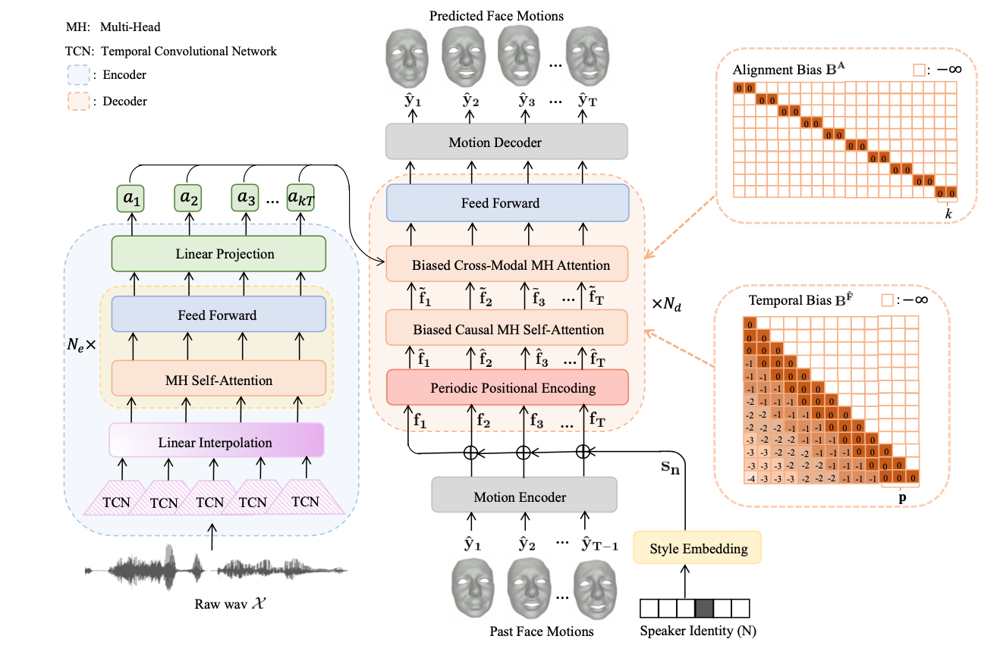

## FaceFormer

PyTorch implementation for the paper:

**FaceFormer: Speech-Driven 3D Facial Animation with Transformers**. ***CVPR 2022*** [[PDF]](https://arxiv.org/pdf/2112.05329.pdf)[[Project Page]](https://evelynfan.github.io/audio2face/)

<p align="center">

</p>

## Environment

- Ubuntu 18.04.1
- Python 3.7
- Pytorch 1.9.0

## Dependencies

- Check the required python packages in `requirements.txt`.
- ffmpeg
- [MPI-IS/mesh](https://github.com/MPI-IS/mesh)

## Data

### VOCASET
 
Request the VOCASET data from [https://voca.is.tue.mpg.de/](https://voca.is.tue.mpg.de/). Place the downloaded files `data_verts.npy`, `raw_audio_fixed.pkl`, `templates.pkl` and `subj_seq_to_idx.pkl` in the folder `VOCASET`. Download "FLAME_sample.ply" from [voca](https://github.com/TimoBolkart/voca/tree/master/template) and put it in `VOCASET/templates`.

### BIWI
 
Request the BIWI dataset from [Biwi 3D Audiovisual Corpus of Affective Communication](https://data.vision.ee.ethz.ch/cvl/datasets/b3dac2.en.html). The dataset contains the following subfolders:

- 'faces' contains the binary (.vl) files for the tracked facial geometries. 
- 'rigid_scans' contains the templates stored as .obj files. 
- 'audio' contains audio signals stored as .wav files. 

Place the folders 'faces' and 'rigid_scans' in `BIWI` and place the wav files in `BIWI/wav`.

## Demo

Download the pretrained models from [biwi.pth](https://drive.google.com/file/d/1WR1P25EE7Aj1nDZ4MeRsqdyGnGzmkbPX/view?usp=sharing) and [vocaset.pth](https://drive.google.com/file/d/1GUQBk9FqUimoT6UNgU0gyQnjGv-2_Lyp/view?usp=sharing). Put the pretrained models under `BIWI` and `VOCASET` folders, respectively. Given the audio signal,

- to animate a mesh in BIWI topology, run: 
	```
	python demo.py --model_name biwi --wav_path "demo/wav/test.wav" --dataset BIWI --vertice_dim 70110  --feature_dim 128 --period 25 --fps 25 --train_subjects "F2 F3 F4 M3 M4 M5" --test_subjects "F1 F5 F6 F7 F8 M1 M2 M6" --condition M3 --subject M1
	```

- to animate a mesh in FLAME topology, run: 
	```
	python demo.py --model_name vocaset --wav_path "demo/wav/test.wav" --dataset vocaset --vertice_dim 15069 --feature_dim 64 --period 30  --fps 30  --train_subjects "FaceTalk_170728_03272_TA FaceTalk_170904_00128_TA FaceTalk_170725_00137_TA FaceTalk_170915_00223_TA FaceTalk_170811_03274_TA FaceTalk_170913_03279_TA FaceTalk_170904_03276_TA FaceTalk_170912_03278_TA" --test_subjects "FaceTalk_170809_00138_TA FaceTalk_170731_00024_TA" --condition FaceTalk_170913_03279_TA --subject FaceTalk_170809_00138_TA
	```
	This script will automatically generate the rendered videos in the `demo/output` folder. You can also put your own test audio file (.wav format) under the `demo/wav` folder and specify `--wav_path "demo/wav/test.wav"` accordingly.

## Training and Testing on VOCASET

###  Data Preparation

- Read the vertices/audio data and convert them to .npy/.wav files stored in `vocaset/vertices_npy` and `vocaset/wav`:

	```
	cd VOCASET
	python process_voca_data.py
	```

### Training and Testing

- To train the model on VOCASET and obtain the results on the testing set, run:

	```
	python main.py --dataset vocaset --vertice_dim 15069 --feature_dim 64 --period 30 --train_subjects "FaceTalk_170728_03272_TA FaceTalk_170904_00128_TA FaceTalk_170725_00137_TA FaceTalk_170915_00223_TA FaceTalk_170811_03274_TA FaceTalk_170913_03279_TA FaceTalk_170904_03276_TA FaceTalk_170912_03278_TA" --val_subjects "FaceTalk_170811_03275_TA FaceTalk_170908_03277_TA" --test_subjects "FaceTalk_170809_00138_TA FaceTalk_170731_00024_TA"
	```
	The results and the trained models will be saved to `vocaset/result` and `vocaset/save`.

### Visualization

- To visualize the results, run:

	```
	python render.py --dataset vocaset --vertice_dim 15069 --fps 30
	```
	You can find the outputs in the `vocaset/output` folder.

## Training and Testing on BIWI

###  Data Preparation

- (to do) Read the geometry data and convert them to .npy files stored in `BIWI/vertices_npy`.

### Training and Testing

- To train the model on BIWI and obtain the results on testing set, run:

	```
	python main.py --dataset BIWI --vertice_dim 70110 --feature_dim 128 --period 25 --train_subjects "F2 F3 F4 M3 M4 M5" --val_subjects "F2 F3 F4 M3 M4 M5" --test_subjects "F1 F5 F6 F7 F8 M1 M2 M6"
	```
	The results will be available in the `BIWI/result` folder. The trained models will be saved in the `BIWI/save` folder.

### Visualization

- To visualize the results, run:

	```
	python render.py --dataset BIWI --vertice_dim 70110 --fps 25
	```
	The rendered videos will be available in the `BIWI/output` folder.

## Using Your Own Dataset

###  Data Preparation

- Create the dataset directory `<dataset_dir>` in `FaceFormer` directory. 

- Place your vertices data (.npy format) and audio data (.wav format)  in `<dataset_dir>/vertices_npy` and `<dataset_dir>/wav` folders, respectively. 

- Save the templates of all subjects to a `templates.pkl` file and put it in `<dataset_dir>`, as done for BIWI and vocaset. Export an arbitary template to .ply format and put it in `<dataset_dir>/templates/`.

### Training and Testing

- Create the train, val and test splits by specifying `--train_subjects`, `--val_subjects` and `--test_subjects` in `main.py`. 

- Train a FaceFormer model on your own dataset by specifying `--dataset` and `--vertice_dim` (number of vertices in your mesh * 3) in `main.py`. You might need to adjust `--feature_dim` and `--period` to your dataset. Run `main.py`.

- The results and models will be saved to `<dataset_dir>/result` and `<dataset_dir>/save`.

### Visualization

- Specify `--dataset`, `--vertice_dim` and `--fps` in `render.py`. Run `render.py` to visualize the results. The rendered videos will be saved to `<dataset_dir>/output`.

## Citation

If you find this code useful for your work, please consider citing:
```
@inproceedings{faceformer2022,
title={FaceFormer: Speech-Driven 3D Facial Animation with Transformers},
author={Fan, Yingruo and Lin, Zhaojiang and Saito, Jun and Wang, Wenping and Komura, Taku},
booktitle={Proceedings of the IEEE/CVF Conference on Computer Vision and Pattern Recognition (CVPR)},
year={2022}
}
```

## Acknowledgement

We gratefully acknowledge ETHZ-CVL for providing the [B3D(AC)2](https://data.vision.ee.ethz.ch/cvl/datasets/b3dac2.en.html) database and MPI-IS for releasing the [VOCASET](https://voca.is.tue.mpg.de/) dataset. The implementation of wav2vec2 is built upon [huggingface-transformers](https://github.com/huggingface/transformers/blob/master/src/transformers/models/wav2vec2/modeling_wav2vec2.py), and the temporal bias is modified from [ALiBi](https://github.com/ofirpress/attention_with_linear_biases). We use [MPI-IS/mesh](https://github.com/MPI-IS/mesh) for mesh processing and [VOCA/rendering](https://github.com/TimoBolkart/voca) for rendering. We thank the authors for their excellent works. Any third-party packages are owned by their respective authors and must be used under their respective licenses.


